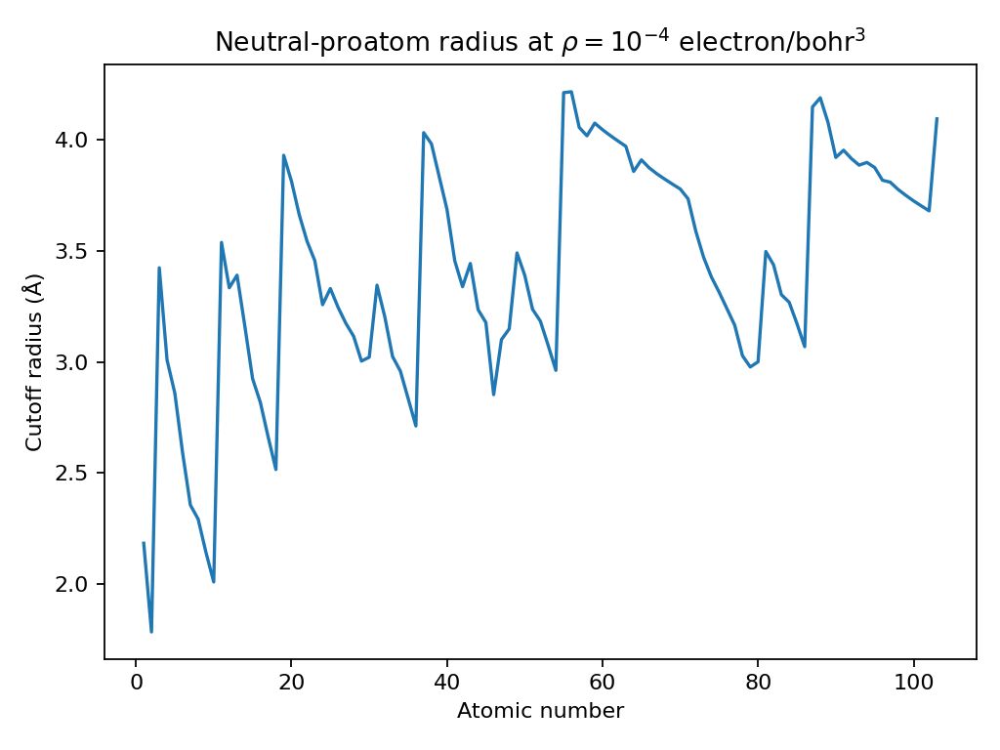
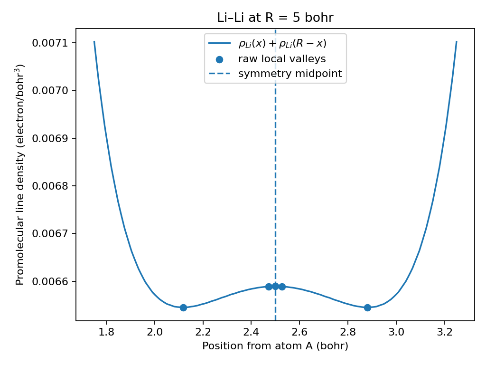
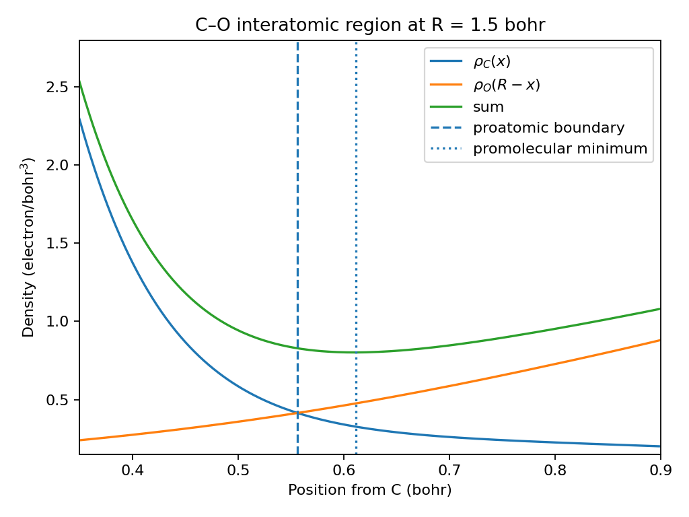

# Pairwise boundary and IAS-proxy method selection

Stage 4 originally considered a numerically exhaustive search for every local
minimum of the neutral-promolecular line density between two atoms. The review
work showed that this contract is possible, but it makes interpolation-scale
features, one-ULP knot behavior, sub-ULP event ordering, and exact tie handling
part of the public science.

That is more precision than the intended geometry workflow needs. The revised
Stage 4 keeps two explicit methods instead of hiding one policy behind a single
number.

## Recommended default: proatomic boundary

The default method returns a stable neutral-proatom divider:

- identical atoms use the exact midpoint;
- overlapping unlike atoms use the point where the two neutral proatomic
  densities are equal;
- separated low-density contours use the midpoint of the contour gap;
- complete one-atom dominance is reported explicitly.

The fixed per-atom tail cutoff is
`1e-4 electron/bohr^3`. It is a model policy for ignoring weak neutral-proatom
tails, not a universal QTAIM interaction threshold.



## Optional: practical promolecular minimum

The optional minimum method is retained for Bader-oriented comparison and
calibration. It searches the sum of the two proatomic densities only where both
components remain above the cutoff.

The search has a declared spatial resolution of `0.01 bohr`. It returns one
resolved minimum and, when useful, one competitive alternative. It does not
attempt to preserve every mathematical microminimum. Raw refined candidates
from the required `0.02` and `0.01 bohr` passes, and from the `0.005 bohr`
fallback when used, are combined before one resolution-coalescing step.
Position-sorted candidates connected by successive gaps below `0.01 bohr`
represent one resolved valley. Distinct adjacent binary64 grid coordinates are
retained so both endpoints and the midpoint remain available near cutoff
contact. Refined cutoff endpoints and nuclei are discarded rather than clamped.

For identical atoms, symmetry still fixes the returned coordinate at `R/2`.
The Li–Li example shows why this rule is necessary: the raw interpolant has
slightly deeper symmetric off-centre valleys, but either one alone is a poor
separator for identical atoms.



The two methods are scientifically different. For C–O at 1.5 bohr, the
balanced-contribution coordinate and the promolecular minimum do not coincide.
That disagreement is expected rather than a solver defect.



## Numerical evidence

The executed study compared the practical minimum search with a slower
`0.001 bohr` reference over 300 deterministic H–Lr cases and seven adversarial
cases from the Stage 4A review.

- All 298 cases where both methods returned a minimum agreed within
  `0.01 bohr`.
- The largest coordinate difference was about `0.00129 bohr`.
- Two extremely short-distance reference minima were intentionally reported as
  unresolved because they were narrower than the public practical resolution
  and lay immediately beside a nucleus.
- On the recorded review machine, the research prototype took roughly
  `0.05–0.06 ms` per cached boundary estimate and about `0.8 ms` per cached
  practical minimum estimate.

These figures are evidence, not portable performance guarantees.

## Why exhaustive all-minima search is not the default

The exact Stage 4A investigation found real edge cases:

- a minimum only 27 binary64 coordinates from a profile knot;
- one-ULP inversions at exact knots;
- multiple shallow or symmetric minima, including five for Li–Li at 5 bohr;
- fourteen H–U minima in a case where a boundary value was lower;
- distinct exact events that rounded to one float;
- value errors large enough to complicate exact global-tie classification.

Those facts matter under an “expose every local minimum” contract. They do not
materially improve a stable pairwise divider, and the revised minimum mode
coalesces or rejects structure below its declared resolution.

## Public API

```python
estimate_proatomic_boundary(...)
estimate_promolecular_density_minimum(...)
estimate_ias_position(..., mode="boundary" | "minimum")
```

`boundary` is the default. The dispatcher never silently switches modes.
Neither result is an exact molecular-density QTAIM surface.

## Scientific context

The interpretation follows three established ideas while keeping their scopes
separate:

- QTAIM basin boundaries are zero-flux surfaces of the molecular electron
  density: Bader, *Chemical Reviews* **91** (1991), 893–928,
  [doi:10.1021/cr00005a013](https://doi.org/10.1021/cr00005a013).
- Hirshfeld stockholder weights are proportional to free-atom reference
  densities, which motivates equal pairwise contributions as a stable divider:
  Hirshfeld, *Theoretica Chimica Acta* **44** (1977), 129–138,
  [doi:10.1007/BF00549096](https://doi.org/10.1007/BF00549096).
- Radial-density atom and bond constructions are useful model definitions but
  require comparison with molecular-density results: Warburton, Poirier, and
  Nippard, *J. Phys. Chem. A* **115** (2011), 852–867,
  [doi:10.1021/jp1093417](https://doi.org/10.1021/jp1093417).

The complete calculations, representative profiles, adversarial cases, and
local timing record are in the directly rendered
[`04-ias-method-selection-study.ipynb`](../notebooks/04-ias-method-selection-study.ipynb)
notebook. Its committed outputs are shown without re-execution during the
documentation build.
